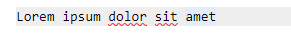

[](https://travis-ci.org/olinox14/FullMd) 

#  FullMd


**FullMD** is a [Markdown](https://daringfireball.net/projects/markdown/syntax) formatting [Visual Studio Code](https://code.visualstudio.com/) extension that provides a lot of convenients keyboard shortcuts.

* Usual operations, like toggling *italic*, **bold**, or ~~striketrough~~, `blockcodes`...
* Set / Increase / Decrease ***header*** level
* Smart ***links*** formatting
* Insert ***tables***, add columns or row dynamically, recognize csv
* Easy use of ***checklists***

## Usage

### Keys
<kbd>B</kbd>   
| Keys | Command |
| ----- | ----- |
| <kbd>Alt</kbd> + <kbd>Enter</kbd>  | Insert a **line break** |
| <kbd>Ctrl</kbd> + <kbd>/</kbd>  | **Escape** special characters from the selection |
| <kbd>Ctrl</kbd> + <kbd>D</kbd>  | Increase the **header** level |
| <kbd>Ctrl</kbd> + <kbd>Shift</kbd>  + <kbd>D</kbd> | Decrease the **header** level |
| <kbd>Ctrl</kbd> + <kbd>Shift</kbd>  + <kbd>[Num]</kbd> | Set the **header**'s level (from 1 to 5) |
| <kbd>Ctrl</kbd> + <kbd>Shift</kbd>  + <kbd>9</kbd> | Remove the **header**'s formatting |
| <kbd>Ctrl</kbd> + <kbd>I</kbd>  | Toggle **italic** format |
| <kbd>Ctrl</kbd> + <kbd>B</kbd>  | Toggle **bold** format |
| <kbd>Ctrl</kbd> + <kbd>Alt</kbd>  + <kbd>S</kbd> | Toggle **striketrough** format |
| <kbd>Ctrl</kbd> + <kbd>L</kbd>  | Toggle **link** format |
| <kbd>Ctrl</kbd> + <kbd>[Num]</kbd>  | Toggle **numeric-style link** format |
| <kbd>Ctrl</kbd> + <kbd>G</kbd>  | Toggle **image**-link format |
| <kbd>Ctrl</kbd> + <kbd>Q</kbd>  | Toggle **blockquote** |
| <kbd>Ctrl</kbd> + <kbd>R</kbd>  | Insert **horizontal ruler**  |
| <kbd>Ctrl</kbd> + <kbd>K</kbd>  | Toggle **code-block** format |
| <kbd>Ctrl</kbd> + <kbd>U</kbd>  | Toggle **unordered list** format |
| <kbd>Ctrl</kbd> + <kbd>O</kbd>  | Toggle **ordered list** format  |
| <kbd>Alt</kbd> + <kbd>X</kbd>  | Toggle **checklist** format   |
| <kbd>Alt</kbd> + <kbd>C</kbd>  | **Check / uncheck** current item of a checklist |
| <kbd>Ctrl</kbd> + <kbd>T</kbd>   <kbd>T</kbd> |  Insert or format a **table** |
| <kbd>Ctrl</kbd> + <kbd>T</kbd>   <kbd>Right</kbd> | **Add a column** to the current table  |
| <kbd>Ctrl</kbd> + <kbd>T</kbd>   <kbd>Down</kbd> | **Add a row** to the current table |
| <kbd>Alt</kbd> + <kbd>Z</kbd>  | Toggle **Zen Mode** |
| <kbd>Alt</kbd> + <kbd>V</kbd>  | Show **side-preview** |

### Line-breaks

Use `Ctrl + Enter` to insert a markdown line break, i.e. two spaces and a line break

### Escaping

Use `Ctrl + /` to escape each special characters from the selected text.

<kbd></kbd>

### Basic formatting

**FullMd** will perform the basic formatting operations, like bold, italic, striketrough, blockquotes, codeblocks...

<kbd></kbd>

<kbd></kbd>

<kbd></kbd>

<kbd></kbd>

<kbd></kbd>

### Headers

Use `Ctrl + Shift + [Num]` to set the current line's header's level to `num`, whith `num` between 1 and 5. `Ctrl + Shift + 9` will reset the format.

<kbd></kbd>

Use `Ctrl + h` and `Ctrl + Shift + h` to increment or decrement the header's level.

<kbd></kbd>

### Lists

Use:

* `Ctrl + U` to format the selected lines into an unordered list.
* `Ctrl + O` to format the selected lines into an ordered list.
* `Alt + X` to format the selected lines into a checklist
* `Alt + C` to check or uncheck a checklist item.

<kbd></kbd>

### Links

The `Ctrl + L` command will toggle the link formatting.

The behaviour will depends on the current selection:
> NB: '§' is the cursor position

    [abc](url) => [abc](url)   // does nothing
    [abc]() => abc§            // abc can be an empty string
    [](url) => <url>§
    <url> => url§
    url => [§](url)
    abc => [abc](§)            // if none url in the clipboard; abc can be an empty string
    abc => [abc](url)§         // if an url was found in the clipboard; abc can be an empty string

<kbd></kbd>

<kbd></kbd>

<kbd></kbd>

### Numeric references

The `Ctrl + [Num]` command will transform a `[title](link)` formatted link to a numeric reference, like:

```
[title][1]

(...)

[1]: url
```

> The url is automatically added at the end of the current document

If used again, the operation is reversed but the reference at the bottom is **NOT** deleted.

<kbd></kbd>

### Tables

Use `Ctrl + T T` to insert a table. This command will also format a csv-like block of text.

Once the table has been added, you can use `Ctrl + T Right` and `Ctrl + T Down` to add a column or a row to it.

<kbd></kbd>

<kbd></kbd>

<kbd></kbd>

## Credits

Thanks to the author(s) of the following extensions, which inspired me some parts of FullMd:

* [vscode-markdown-shortcuts](https://github.com/mdickin/vscode-markdown-shortcuts)
* [vscode-markdown](https://github.com/yzhang-gh/vscode-markdown)

## Licence

**FullMd** is under [GNU Licence](LICENCE)